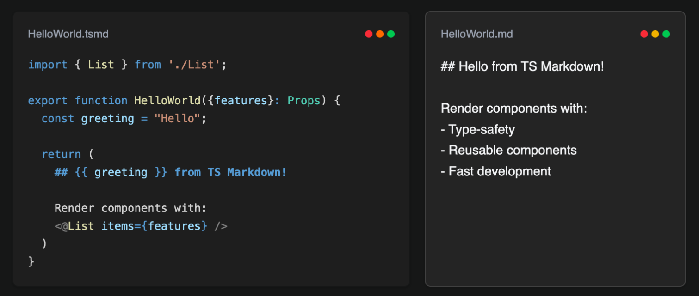

# TS Markdown Language VS Code Extension

This VS Code extension provides support for the tsmd language.

### General features

1. **TypeScript Integration** - Full TypeScript support with type checking and IntelliSense
2. **Template Interpolation** - Dynamic content with `{{ expression }}` syntax
3. **Conditional Rendering** - Smart conditional blocks with ternary operators and logical AND
4. **Developer Tools** - Comprehensive CLI, VS Code extension, and testing utilities

## Documentation

See our [documentation](https://tsmarkdown.dev)
